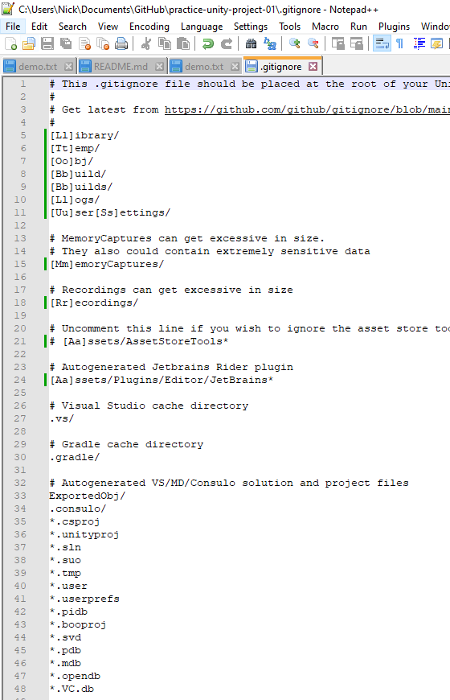
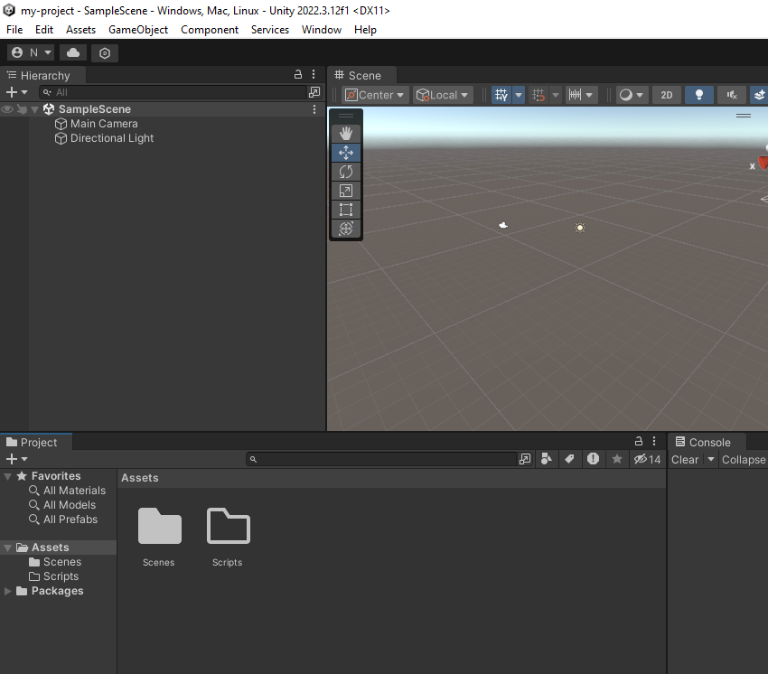

# Participation: A Unity Project in GitHub

## Goal and Why are we doing this?

To integrate all we have learned with git, GitHub, and version control with Unity. We need to be able to use these concepts with Unity in order to make games. Before we jump into our big game project, let's get comfortable with the basics of setting up a new Unity project and having it use version control. 

## Instructions

### Creating the repo

First, we need to set up a new repo. We have done this a few times. So it should be familiar.

I called my repo: `practice-unity-project-01`.

As usual, initialize your repo with a README.md file. But this will be the first time we use a `.gitignore`. I won't go into too much detail. You can read up on it more on your own, but basically, this file is going to tell git to ***ignore*** a bunch of files in our project folder and not include them in the version history. Because of that, we will only keep track of more important stuff like our scripts. I think that is a good enough description to get us moving on for today.

git comes built-in with some default `.gitignore` files. One of which is made for Unity. That is pretty convenient. So, we don't have to write one ourselves. But you could if you wanted. 

Select "Unity" from the drop down list for our `.gitignore` field. 

I'll still leave license as NONE since this is just a simple learning exercise.

Create the repo.

### Cloning the repo

Open up GitHub Desktop and clone the newly made repo down to your personal machine.

When you clone it down, be aware of where you placed it. You'll need to know this later when we create our unity project. 

Open up the folder location. Look inside your project folder. In addition to the `README.md` file, we should also see the `.gitignore` file we made. 

### Creating a Unity project

Ok. Now it is time to create a new Unity project. Open up Unity Hub, and create a unity project like we always do.

I'm going to call mine "my-project". I'm also going to place the Unity project inside my repo folder that we just made. This way the project will be in the version controlled folder, and git can keep track of all the history. 

Go and create the Unity project.

Once done loading, we can check our repo folder again. We should now see our Unity project folder inside of it. 

And if we opened that up, we should see all our unity stuff. Check it for sanity sake. But everything is probably there. 

Nice.

### Editing the .gitignore file

Now, if we look back at GitHub Desktop, then we will notice there are quite a few files sitting on the dock to be committed. We need to fix something before we can move further. 

git's default git ignore for Unity assumes that your project folder is the root of your repo folder. 

We did not set it up this way. We set it up where our unity folder is inside our repo folder. I personally think this is better practice. As there might be other files related to your game project that you might want to keep in version control. Like for example a game design document or a team member contact list. Which has nothing to do with the unity project folder, but still important to keep in version control. 

But personal organization aside. We now need to fix this. 

Go and open the `.gitignore` file. (you can open it up with any text editor) 

At the top of the file there are a bunch of folder paths. In my screenshot, they start on line 5 with "/[Ll]ibrary/"

We essentially need to change the path and remove the first slash from each of these.

Look at the screenshot below for comparison.

Don't forget to scroll down and fix all of them. For example, line 15, 18, etc etc. 

Save the `.gitignore` file.

If we looked at GitHub Desktop now, then wow, a lot less files to worry about in git. Our `.gitignore` file is now doing its job.

### The initial commit

At this point, I can say I am happy with where we are at. Let's make a commit to our project. Let's call it the initial commit, or something similar, just so we have a starting point. 

When you have done that, don't forget to also push. 

Check GitHub.com to see if everything looks good!

Awesome. Things are looking good.

### Some test examples of a typical project

Ok. Now we are "set up". Let's go into Unity and create some examples that we might do in a project. 

First thing we might do is create a new "Scripts" folder to stay organized. (Like we have done a few times in the past) 

Go and make a Scripts folder. Inside that folder, make a new script called "Hello_World".

Open that script up in Visual Studio.

Add in a simple print that says, "Hello world!".

Let's go back to GitHub Desktop.

We now see the new Scripts folder we made along with our Hello_World script with all the changes.

This is great! Now we can keep track of our work using version control! 

Let's commit this edit to the project, then push it up to GitHub.com

Keeping track of scripts is the most common thing you will do with version control and a game project in Unity. 

But there is also another common thing. And we will get into it in the next chapter. Unity objects such as a cube. Even other edits to a scene. 

Let's get a quick practice with that as well.

Go back into unity. Let's add a simple cube to our scene.

Save the scene.

Go back to GitHub Desktop. You'll see that git has noticed the changes to our unity scene. 

It's not as easy to read as our code or text files were. 

We won't get into that now. As we need to keep moving forward for our course of Intro to Programming in Unity. 

But as far as we care today... It does its job, and we can also keep track of these other things like the state of our scene. 

Go and commit, then push the changes to your project. 

## Conclusion

At this point, we have successfully set up a basic unity project, used version control with it, and even explored some typical things we might do in a full project. 

This is good because we are about to start our big game project and work on "Hero Born" over the next few chapters. 

## Submitting

Don't forget to submit to the blackboard dropbox. See the assignment for submission guidelines.