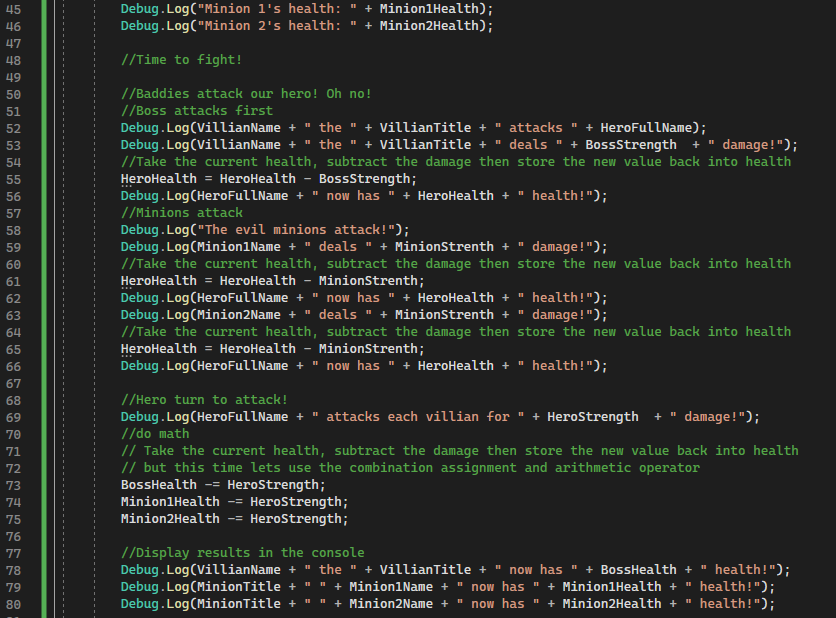

# Participation: Exploring Variables

## Goal

To mess around with variables and get more comfortable with the basics.

## Instructions

Ok. We want to mess around with some variables today, but before we can do that we will need to create a new Unity project. You remember how to do that right? You can name it and save it wherever you want. But just remember where you save it. We will need to be aware of the location at the end to submit files.

After you get your project set up and ready to go, please make a new script. Again, you can call it whatever you want. 

Once you have your script open in your preferred code editor, let's do what we came here to do, make some variables! In order to stay somewhat neat about it, let's add a comment that says "Variables" as well. 

Just to kinda get an idea of where we are at, this is what my screen looks like at the moment. 


Ok. Let's ***declare*** some variables. Let's declare 3 new string variables, one called: `HeroFirstName`, one called `HeroLastName`, and one called `HeroFullName`.

Let's also initialize `HeroFirstName` and set it equal to your first name. Initialize `HeroLastName` and set it equal to your last name. Mine would be "Nick" and "Buonarota" respectivly.

Your code might look something like this now:


Awesome. Let's move down to line 13 so we can write some code inside the `Start()` Method.

Let's use the variables we made earlier to form our hero's full name. Concatenate the strings `HeroFirstName` and `HeroLastName` together and store the value in `HeroFullName`. 

> **Thought Bubble:** Does the order of the concatenation matter? Does `HeroFirstName` + `HeroLastName` produce the same or a different result of `HeroLastName` + `HeroFirstName`?

Let's print some stuff out to the console to prove to the world that we know what we are doing.

Let's add 2 new debug prints. One debug that prints out "Behold the glorious hero!" and then another that prints out the value stored in `HeroFullName`. Do you think you can get your console to look like the below screenshot? If not then raise your hand and ask instructor Nick to come over. 


What if we wanted to put all of that into one Debug print? Well, we can also use string concatenation here too! In fact, this will be super valuable when we want to debug our programs later and add "labels" when we print out data values to the console.

Let's change up our console print. Delete the last 2 lines, and make a new debug log that announces our hero in style. Do you think you can get your console to look like the below screenshot? 


If not, then use this screenshot for a hint:


Let's make 2 more string variables. But this time let's make them public so they can also show up in the Unity Inspector. Go back up to where we declared all our previous variables and make 2 new string variables called `VillianTitle` and `MinionTitle`.

Let's make 3 more string variables, but this time let's make them private so that they don't show up in the inspector. Let's declare these variables as `VillianName`, `Minion1Name`, and `Minion2Name`.

Our code should look something like this:


Let's move over to the Unity inspector to see if our variables appear.


Sure enough, we now see our variables. We don't see `VillianName`, `Minion1Name`, and `Minion2Name` because they are set to private. We also don't see `HeroFirstName`, `HeroLastName`, and `HeroFullName` because we didn't specify the access level. In C#, when you don't specify the access level, variables will default to private.

In the Unity inspector, let's set some values. Set `VillianTitle` to something you think is worthy and `MinionTitle` to something you think is fun. I'll set mine to "Lord of Darkness" and "Background Grunt" respectively.


Go back to your script and inside the start method, after your print, initialize the new bad guys with some names. You can name them whatever you want. These are the names I went with:


Let's have a little fun and start making a mini story! You can check out my prints and my console below for inspiration. 


I think we are good on strings for now. Let's mess with another common data type. Let's pick the integer so we can have some fun with numbers!

Go back up to where we have been declaring all our variables. Let's declare the following integers:

- HeroHealth
- HeroStrength
- BossHealth
- BossStrength
- Minion1Health
- Minion2Health
- MinionStrength

Actually, while we are here we might as well initalise these variables as well. Go ahead and give them the following starting values:

- HeroHealth = 100
- HeroStrength = 50
- BossHealth = 100
- BossStrength = 25
- Minion1Health = 50
- Minion2Health = 50
- MinionStrength = 5


Let's continue our story in the console and display all the character's health before the big fight! Here is an example of what I did:


Now let's do some math on our numbers! Let's simulate a fight!

Here is my code. Read the comments to get an idea of what is going on. If you are still confused, then raise your hand and ask instructor Nick to explain.




Because 50 - 50 is 0. The minions have been defeated. Nice! Let's print that to the console.


At the end of the round of combat, let's print out our hero's health, have them eat a piece of food that restores 1 health, then re-print the health to see if the number updated.

Let's use the special **increment operator** for this operation.


Let's check out the console to see if the numbers changed the way we expected them to change.


Sweet! `HeroHealth` was incremented by 1. Exactly what we expected to happen with the **increment operator** of `++`

Ok, let's finish this fight. 

The code is similar to before, so you can probably write it up yourself, but in case you want, you can reference mine here:


Results of the console prints:


I think it would be nice to wrap up our story. Let's write two more lines to the console. 


Awesome work! 

## Reference

If you want reference to the full script, then you can find it here:

```C#
using System.Collections;
using System.Collections.Generic;
using UnityEngine;

public class LearningCurve : MonoBehaviour
{
    //Variables
    string HeroFirstName = "Nick";
    string HeroLastName = "Buonarota";
    string HeroFullName;
    public string VillianTitle;
    public string MinionTitle;
    private string VillianName;
    private string Minion1Name;
    private string Minion2Name;

    int HeroHealth = 100;
    int HeroStrength = 50;
    int BossHealth = 100;
    int BossStrength = 25;
    int Minion1Health = 50;
    int Minion2Health = 50;
    int MinionStrenth = 5;

    // Start is called before the first frame update
    void Start() 
    {
        HeroFullName = HeroFirstName + " " + HeroLastName;

        Debug.Log("Behold the legendary hero of programming, whose name is: " + HeroFullName);

        VillianName = "Steve";
        Minion1Name = "Joe";
        Minion2Name = "Shmoe";

        Debug.Log(HeroFullName + "'s arch rivial is " + VillianName + " the " + VillianTitle);

        //We can't forget about the minions!
        Debug.Log(VillianName + " the " + VillianTitle + " is helped out by: " + MinionTitle + " " + Minion1Name + " and " + MinionTitle + " " + Minion2Name);

        //Are you prepared to fight!
        Debug.Log("The fighters enter the room!");
        Debug.Log("Hero's health: " + HeroHealth);
        Debug.Log("Boss's health: " + BossHealth);
        Debug.Log("Minion 1's health: " + Minion1Health);
        Debug.Log("Minion 2's health: " + Minion2Health);

        //Time to fight!

        //Baddies attack our hero! Oh no!
        //Boss attacks first
        Debug.Log(VillianName + " the " + VillianTitle + " attacks " + HeroFullName);
        Debug.Log(VillianName + " the " + VillianTitle + " deals " + BossStrength  + " damage!");
        //Take the cuurent health, subtract the damage then store the new value back into health
        HeroHealth = HeroHealth - BossStrength;
        Debug.Log(HeroFullName + " now has " + HeroHealth + " health!");
        //Minions attack
        Debug.Log("The evil minions attack!");
        Debug.Log(Minion1Name + " deals " + MinionStrenth + " damage!");
        //Take the cuurent health, subtract the damage then store the new value back into health
        HeroHealth = HeroHealth - MinionStrenth;
        Debug.Log(HeroFullName + " now has " + HeroHealth + " health!");
        Debug.Log(Minion2Name + " deals " + MinionStrenth + " damage!");
        //Take the cuurent health, subtract the damage then store the new value back into health
        HeroHealth = HeroHealth - MinionStrenth;
        Debug.Log(HeroFullName + " now has " + HeroHealth + " health!");

        //Hero turn to attack!
        Debug.Log(HeroFullName + " attacks each villian for " + HeroStrength  + " damage!");
        //do math
        BossHealth = BossHealth - HeroStrength;
        Minion1Health = Minion1Health - HeroStrength;
        Minion2Health = Minion2Health - HeroStrength;

        //Display results in the console
        Debug.Log(VillianName + " the " + VillianTitle + " now has " + BossHealth + " health!");
        Debug.Log(MinionTitle + " " + Minion1Name + " now has " + Minion1Health + " health!");
        Debug.Log(MinionTitle + " " + Minion2Name + " now has " + Minion2Health + " health!");

        // The minions have been defeated!
        Debug.Log(Minion1Name + " and " + Minion2Name +  " have been defeated!");

        //End of the round buff!
        Debug.Log(HeroFullName + " has " + HeroHealth + " health.");
        Debug.Log(HeroFullName + " eats an apple to restore health!");
        HeroHealth++;
        Debug.Log(HeroFullName + " now has " + HeroHealth + " health!");

        //final round of fight
        Debug.Log("The remaining fighters continue the fight!");
        Debug.Log("Hero's health: " + HeroHealth);
        Debug.Log("Boss's health: " + BossHealth);
        //Boss attacks first
        Debug.Log(VillianName + " the " + VillianTitle + " attacks " + HeroFullName);
        Debug.Log(VillianName + " the " + VillianTitle + " deals " + BossStrength + " damage!");
        //Take the cuurent health, subtract the damage then store the new value back into health
        HeroHealth = HeroHealth - BossStrength;
        Debug.Log(HeroFullName + " now has " + HeroHealth + " health!");
        //Hero turn to attack!
        Debug.Log(HeroFullName + " attacks " + VillianName + " the " + VillianTitle + " for " + HeroStrength + " damage!");
        //do math
        BossHealth = BossHealth - HeroStrength;
        //Display results in the console
        Debug.Log(VillianName + " the " + VillianTitle + " now has " + BossHealth + " health!");

        //Results
        Debug.Log(HeroFullName + " is victorious!");
        Debug.Log("Wealth, glory, and straight A+'s to the winner!");
    }

    // Update is called once per frame
    void Update()
    {
        
    }
}

```

## Conclusion

At this point we have successfully tinkered around with some of the topics we have talked about in class.

We now have some hands on experience with:

- working with various datatypes
- working with public and private variables
- editing public variables in the Unity inspector
- declaring and initalizing variables
- printing to the console
- concatenating strings
- concatenating strings in a debug print to make more advanced console logs
- making a goofy console adventure story via programming

## Submitting

Don't forget to submit to the blackboard dropbox. See the assignment for submission guidelines.