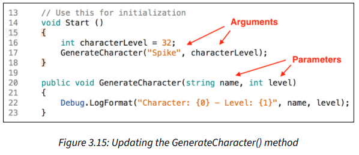

# Participation: Methods

## Goal

To get hands on experience making some of our first ever methods.

## Instructions

Ok. This will be another simple script exercise. So just make a new unity project. You can name it and save it however you like. I don't think that part is critical for this practice exercise. When you have done that, make a new script. Again, the name here doesn't matter. I'll call mine, `method_demo.cs`.

Let's go and declare a method. If we recall from lecture, just like variables, we follow a set structure to declaring a method. 

Our template is as follows:

```
accessModifier returnType UniqueName()
{
    //method body
}
```

Declare a `public` method with a `void` return type called `GenerateCharacter()`:

```C#
public void GenerateCharacter()
{

}
```

Add a simple `Debug.Log()` inside the new method and print out a character name from your favorite game or movie:

```C#
Debug.Log("Character: Spike");
```

Remember, code is a set of instructions. We start at the top and go down line by line, just like a step by step food receipe. In Unity, each script will automatically run it's `Start()` method when the game starts up. But any other methods won't run unless we call them. 

Call `GenerateCharacter()` inside the Start() method:

```C#
void Start()
{
    GenerateCharacter();
}
```

Let's hit play, so we can test and see the output in the console.


Looking good! 

> **Thought Bubble:** *Naming Conventions* - Like variables, methods need unique, meaningful names to distinguish them in code. Methods drive actions, so it’s a good practice to name them with that in mind. For example, `GenerateCharacter()` sounds like a command, which reads well when you call it in a script, whereas a name such as `Summary()` is bland and doesn’t paint a very clear picture of what the method will accomplish. Like variables, method names are written in **Pascal case**.

We’ve seen that lines of code execute sequentially in the order they’re written, but bringing methods into the picture introduces a unique situation. Calling a method tells the program to take a detour into the method instructions, run them one by one, and then resume sequential execution where the method was called.

Take a look at the following screenshot and see whether you can figure out in what order the debug logs will be printed out to the console:


These are the steps that occur:
1. "Choose a character." prints out first because it’s the first line of code.
2. When `GenerateCharacter()` is called, the program jumps to line 23, prints out "Character: Spike", and then resumes execution at line 17.
3. "A fine choice." prints out last, after all the lines in `GenerateCharacter()` code block have finished running.

Now, sometimes methods that don't return data or don't take in parameters can be useful. But sometimes we will add in those abilities so our methods can do much more. Let’s move on and add some method parameters to make `GenerateCharacter()` a bit more interesting.

Let’s update `GenerateCharacter()` so that it can take in two parameters:

Add two method parameters: one for a character’s name of the `string` type, and another for a character’s level of the `int` type:

```C#
public void GenerateCharacter(string name, int level)
```

Update `Debug.Log()` so that it uses these new parameters:

If you recall from lecture, there are 2 big ways to print to the console. Most of the time, we use `Debug.Log()`, but let's mess around with `Debug.LogFormat()` for a moment. If not just to show we can use it. 

```C#
Debug.LogFormat("Character: {0} - Level: {1}", name, level);
```

The special `{0}` and `{1}` will get replaced by `name` and `level` respectively. 

To read up more about `Debug.LogFormat` you can check out the [Unity Scripting Reference: Debug.LogFormat](https://docs.unity3d.com/ScriptReference/Debug.LogFormat.html)

Update the `GenerateCharacter()` method call in `Start()` with your arguments, which can be either literal values or declared variables:

```C#
int CharacterLevel = 32;
GenerateCharacter("Spike", CharacterLevel);
```

Your code should look like the following:



Here, we defined two parameters, name (string) and level (int), and used them inside the `GenerateCharacter()` method, just like local variables. When we called the method inside `Start()`, we added argument values for each parameter with corresponding types. In Figure 3.15, you can see that using the literal string value in quotations produced the same result as using `characterLevel`.


Going even further with methods, you might be wondering how we can pass values from inside the method and back out again. This brings us to our next topic on return values.

Aside from accepting parameters, methods can return values of any C# type. All of our previous examples have used the `void` type, which doesn’t return anything, but being able to write instructions and pass back computed results is where methods shine.

According to our blueprints, method return types are specified after the access modifier. In addition to the type, the method needs to contain the return keyword, followed by the return value. A return value can be a variable, a literal value, or even an expression, as long as it matches the declared return type.

Methods that have a return type of `void` can still use the return keyword with no value or expression assigned. 

Once the line with the return keyword is reached, the method will stop executing. This is useful in cases where you want to check whether a value or values exist before continuing or guard against program crashes.

Next, add a return type to `GenerateCharacter()` and learn how to capture it in a variable. Let’s update the `GenerateCharacter()` method so that it returns an integer:

Change the return type in the method declaration from `void` to `int`, and set the return value to `level += 5` using the `return` keyword:

```C#
public int GenerateCharacter(string name, int level)
{
    Debug.LogFormat("Character: {0} - Level: {1}", name, level);

    return level += 5;
}
```

`GenerateCharacter()` will now return an integer. This is computed by adding 5 to the level argument. We haven’t specified how, or if, we want to use this return value, which means that right now, the script won’t do anything new.

Now, the question becomes: how do we capture and use the newly added return value?

When it comes to using return values, there are two approaches available:
- Create a local variable to capture (store) the returned value.
- Use the calling method itself as a stand-in for the returned value, using it just like a variable. The calling method is the actual line of code that fires the instructions, which, in our example, would be `GenerateCharacter("Spike", CharacterLevel)`. You can even pass a calling method into another method as an argument if need be.

The first option is preferred in most programming circles for its readability. Throwing around method calls as variables can get messy fast, especially when we use them as arguments in other methods.

Let’s give this a try in our code by capturing and debugging the return value that
`GenerateCharacter()` returns.

We’re going to use both ways of capturing and using return variables with two simple debug logs:

Create a new int variable in the `Start` method called `NextSkillLevel` and assign it to the return value of the `GenerateCharacter()` method call we already have in place:

```C#
int NextSkillLevel = GenerateCharacter("Spike", CharacterLevel);
```

Add two debug logs, with the first printing out `NextSkillLevel` and the second printing out a new calling method with argument values of your choice:

```C#
Debug.Log(NextSkillLevel);
Debug.Log(GenerateCharacter("Faye", CharacterLevel));
```

Comment out the debug log inside `GenerateCharacter()` with two forward slashes (//) to make the console output less cluttered. Your code should look like the following:

```C#
void Start()
{
    int CharacterLevel = 32;
    int NextSkillLevel = GenerateCharacter("Spike", CharacterLevel);
    Debug.Log(NextSkillLevel);
    Debug.Log(GenerateCharacter("Faye", CharacterLevel));
}

public int GenerateCharacter(string name, int level)
{
    // Debug.LogFormat("Character: {0} – Level: {1}", name, level);
    return level += 5;
}
```

Save the file and hit Play in Unity. To the compiler, the `NextSkillLevel` variable and the `GenerateCharacter()` method caller represent the same information, namely an integer, which is why both logs show the number 37:


## Conclusion

At this point we have successfully tinkered around with some of the topics we have talked about in class. That was a lot to take in, especially given the exponential possibilities of methods with parameters and return values. 

We will explore these topics further with more in class practice exercises and a more open ended home work. 

## Submitting

Don't forget to submit to the blackboard dropbox. See the assignment for submission guidelines.