# Participation: My First GitHub Repo
## Pre Notes

### Things to know
- **Version control:** A way to keep track of a file's version history over time. 
- **Git:** A version control tool.
- **GitHub:** A community and a place to back-up/store the files. It uses git as the tool for version control.  

### Context Notes

There are many version control tools out there. Some common ones in game development are "git", "perforce", and "svn". 

We will be using git for this class. 

There are also many version control communities out there, such as "GitHub" and "Bitbucket". Some companies even host their own storage locations and may not use a community like GitHub. Other companies, might pay for special enterprise versions or private communities. 

We will be using GitHub public stuff for the purposes of learning and using version control. It should be good enough to serve our purposes.

This isn't a class on version control, tools, or communities, but hopefully, we can become familiar enough with some of the concepts to get us "working" in game development. 

But at some point in the future, it would be very valuable to research these topics further. 

## Goal
To make our first repo, get comfortable with the basic ideas of version control, and actually get some field experience.

## Instructions

This practice exercise will be pretty short. But can still be intimidating if this is new, but don't worry. As we work with it throughout the semester, you will feel more comfortable with it! :smile:

### Setting Up

Hopefully you have already made an account for GitHub. If not, then you'll need to do this now. I suggest using a personal gmail, that way you can keep this account with you as you leave school or leave a job. You can always make another account with a school email or a work email if you need to for special benefits.

Also, the basic public personal editions should be fine. No need to buy any crazy professional enterprise editions for our class purposes.

### Work Time

Now that you have a GitHub account, you can host projects and files on the GitHub servers. This is valuable because our files are now backed-up on the cloud. This also allows us to download our work from the cloud to any computer we work on. AND THAT makes working on our home computers, library computers, or lab computers all the much easier. 

Let's go and view our profile page on GitHub. I'll be using my profile as an example, but you should be looking at your page. 

You can get to your profile by clicking on the profile icon in the upper right hand corner of the website, then when the drop down menu appears, select `Your Profile`.

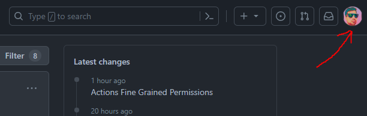
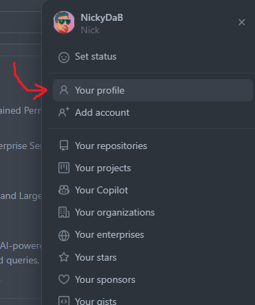

This will bring you to your profile page. You'll also notice that the web address should also be your username. So, that is another way to get to your profile. Mine is: https://github.com/NickyDaB 

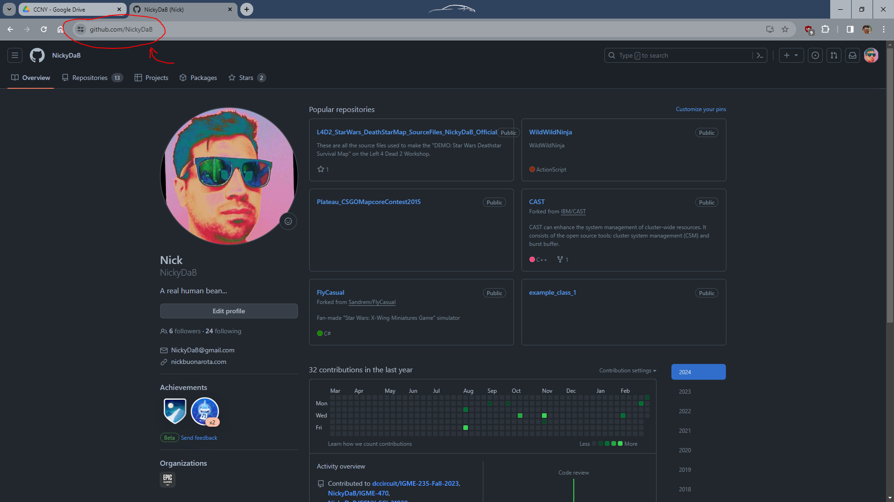

There is a bunch of things here. You can explore on your own. We are going to focus on the `Repositories` tab today.

**Repositories** *(or **repos** as the cool elite hackerz like to call them)* are places where you can store things. And in the context of computing, it is a central location in which data is stored and managed. For us, it is where we will store the scripts for our game projects. 

Let's go and click on the `Repositories` tab.

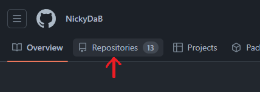

This will bring you to a list of what is essentially all your projects that are hosted on GitHub. Your list is probably empty. I have a few projects from over the years. 

But that will all change soon! You are about to create your first repo and host it on GitHub! Wow! Feel the excitement! Are you ready?

  

On this page, there should be a `New` button near the top left, click it! 

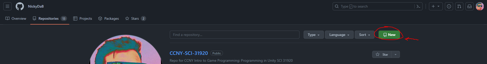

We see a new page, similar to this:

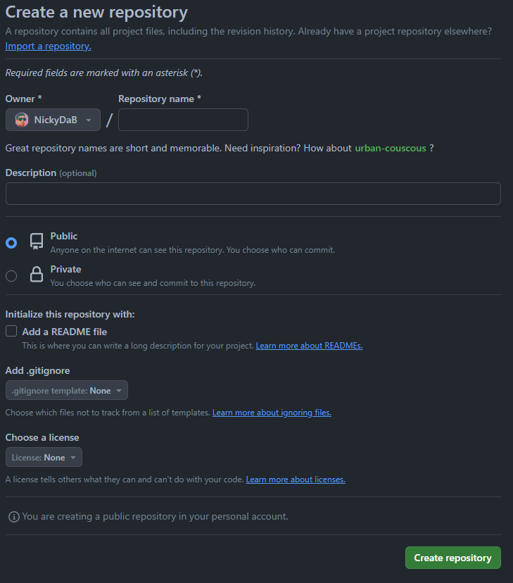

If you look around you should see some things here. They help you set up your repo. 

- **Owner** : Basically who owns and is the admin of your repo. For today, this will be you. In the future, it could be helpful to maybe switch this out for someone else or a organization to own the repo. 

- **Repository name** : Well, we need to call it something right? 

- **Description** : This is optional, but helpful for others who need the "Too Long Didn't Read" about your project. A one sentence description is probably good. 

- **Public / Private** : Visability of your project. For now, let's just make things public. It's easier that way, but in the future, for sensitive data or other projects, you might set this to private.

- **Initalize the repository with** : Some additional quick standard things most repos do, so GitHub added them as fast set up options. I usually always add a readme. In the future we will mess around with gitignore (which tells git to ignore some files in your project folder) and license (which says how others are allowed to use this project). We will leave them as "none" for now.

### Setting Up the Repository

Ok, now that we have the quick overview. Let's fill out the data and make the repository.

For the name I'll go with `my_first_repo`. I have some previous habbits with working with various operating systems. So, for my folders and file names I like to use all lowercase letters and underscores. Feel free to do what ever you want. But understand that the name of the repo will be your "root" folder *(Aka, the folder where all your files will be located)*. Eventually we will copy and clone this folder to our local machine, so that may impact what you call your project folder. 

> ***Side Note:** It might make sense, but you can't create multiple repositories with the same name.*  
>
> 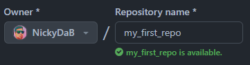
> 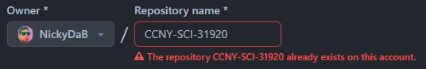

I'll leave description blank, but you could say something like, "I'm just making this to learn about version control." When you have a real project, try to give an actual one sentence description.

Let's leave our first repo as "public".

I'm also going to check add the readme and leave the gitignore and license blank for this exercise. 

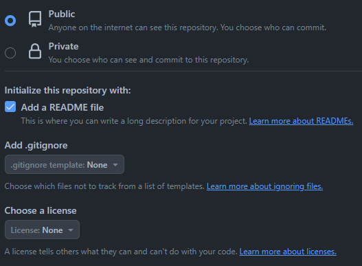

With all that done, we are ready to hit the "create" button.

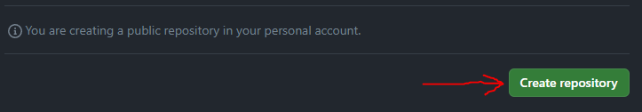

You'll now automatically get brought to the repo's github page.

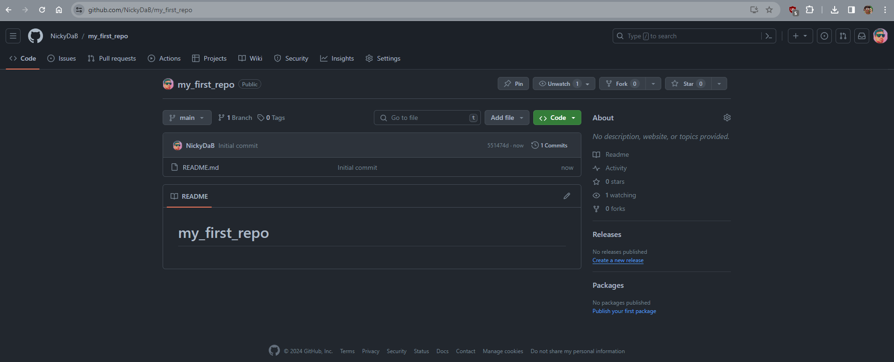

If you look closely, you'll notice that the web address is your account name with the repo name. So, again, another way to get here.

At this point we made a repo, but it is essentially empty. *(well, it has that readme file in it that we auto generated.)* Now we are going to jump to our personal machine and use the program `GitHub Desktop` to `clone` *(aka, "copy" our repo from the cloud to our local computer)*. Let's get to it.

### Setting Up GitHub Desktop

If you are using a lab machine, then you can find `GitHub Desktop` pre-installed. There should be a shortcut on the desktop.

If you are using a personal machine, then you'll probably have to download it. You can find it on the github website here: [Download GitHub Desktop](https://desktop.github.com/)

There are a few ways to use `git` to manage your code, but we will use `Github Desktop` as it integrates nicely with the rest of the tools we are using. 

Once the program is installed, you can go and open it up!

### Using GitHub Desktop

Now, you will have to sign in with your account.

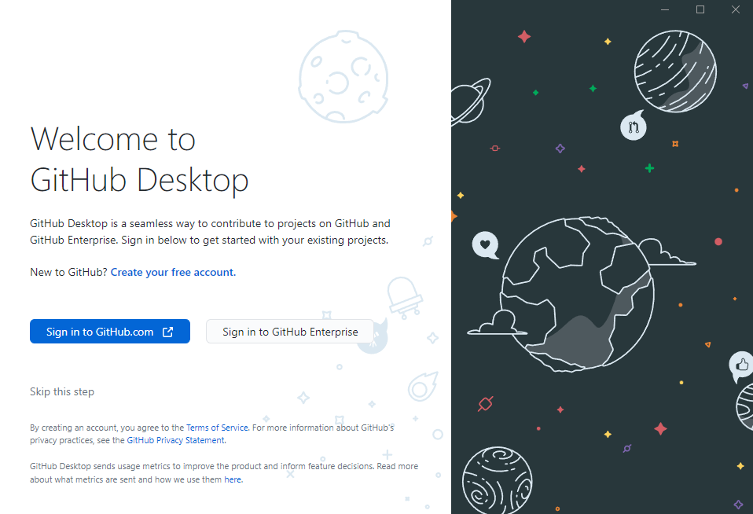

It should open an internet browser, but once you fill out the appropriate information you should be on your way.

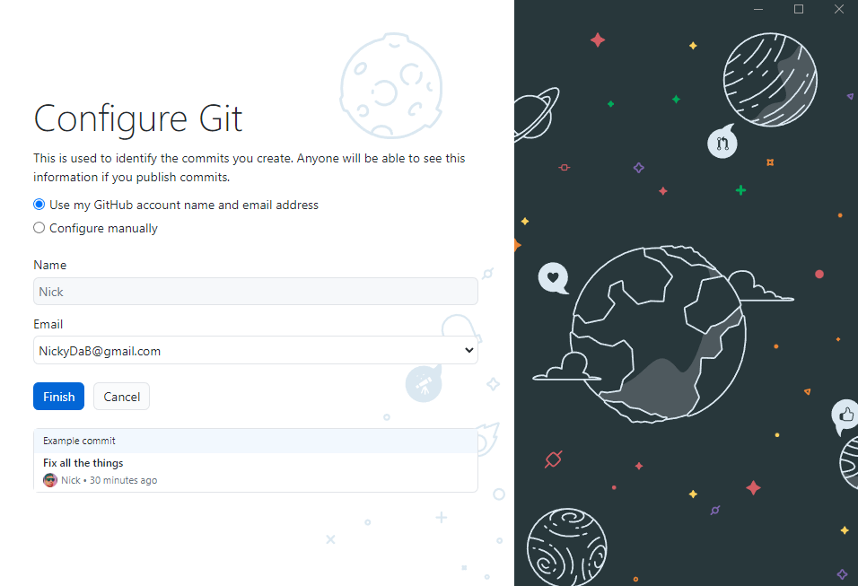

Once you are all logged in you will probably see a page similar to this: 

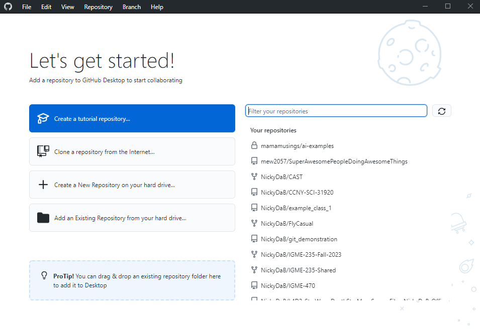
 
> ***Side Note:*** *Extra Learning and Practice*
>
> There seems to be an official GitHub tutorial here. It might be a good idea to tinker around with that over the weekend if you have some free time and want to get the extra practice. But I'll leave that up to you.
>
> 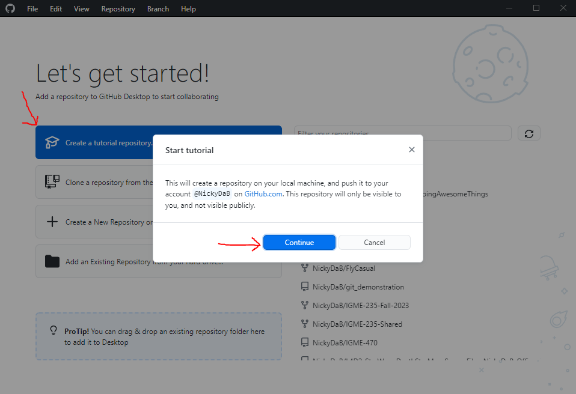

We will continue on with our custom tutorial for class purposes.

Since this is the first time we are cloning a repo, we will do it this way. There are a few ways to go about this, and we will try a few over the next few exercises so you can get a bit of experience with a few of the ways. 

Go to the top left of `GitHub Desktop` and click on `File`. Find the `Clone Repository...` option and then click that. 

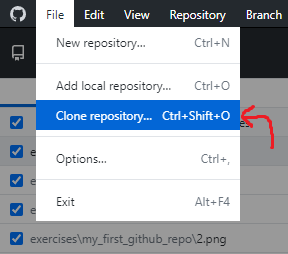

It should open a new dialouge box. 

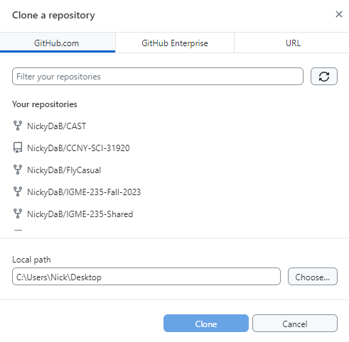

By default, the GitHub.com tab should be selected. If not then, go and click on that tab. This is important because we hosted our repo on github.com if we hosted it somewhere else, then we would need to select a different option.

You should then see your repo because you probably only have one, but if you have a few, then you can either scroll down, or use the filter tool.

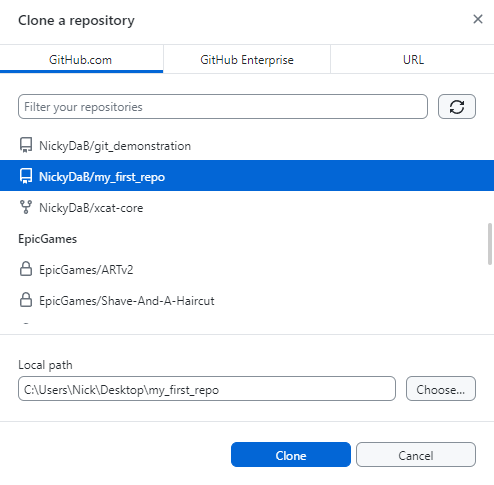

The next thing we need to note is the `Local Path` section. This is where GitHub desktop will clone *(aka - copy)* your repo to on your local machine. 

I think for me, for this first project, puttin git on my desktop with the folder name "my_first_repo" is fine. In the future, we might mess around with putting stuff in different locations. But just remember where you are cloning your files to, this will be important!

Once you are ready, hit the `clone` button. 

You might see something like this now:

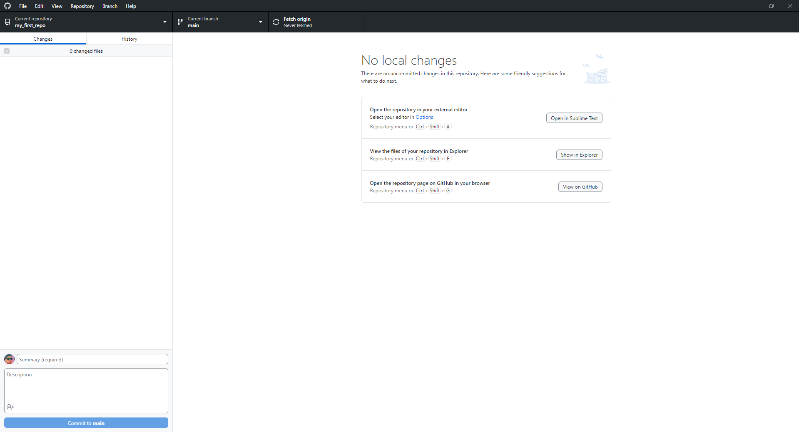

Let's also check the location where we said to **clone** the repo. Remember, I put mine on the Desktop and made the folder "my_first_repo". 

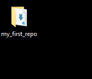
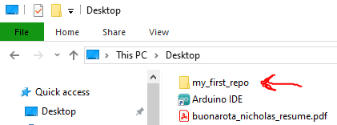

Awesome, looks like my stuff was copied correctly.

If I open the file up we see everthing we saw on GitHub.com - mainly an empty folder with the readme file. 

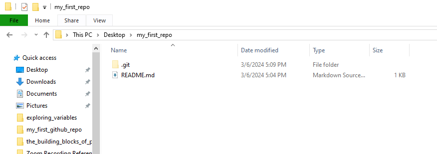

Sweet eveything seems in check. Now, we are pretty much set up to do the actual work.

*Wait... what do you mean **NOW** we start the work!?*

Now, we can finally create a file, use version control, and get some practice with it. 

### Create a file

Inside this folder, make a new text file. You can call it whatever you want. I'll call mine `demo.txt`.

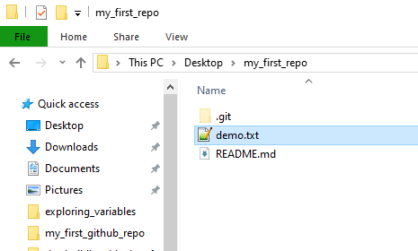

Then open this file up in your text editor of choice. I'm just going to use notepad since this is a simple example, but you could also open it up in Visual Studio if you want. 

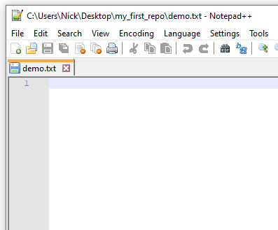

## Conclusion

At this point, I think we have successfully tinkered around with the topics of the week. 

Congratulations! 

## Submitting

Don't forget to submit to the blackboard dropbox. See the assignment for submission guidelines.