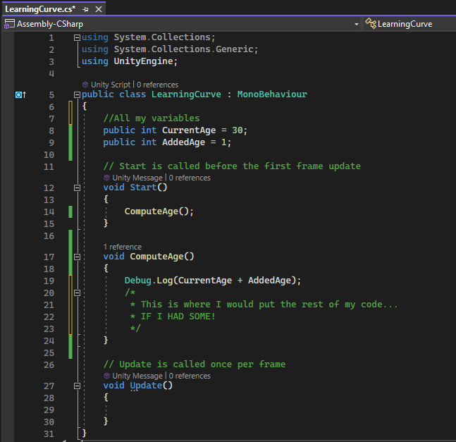

# Participation: The Building Blocks of Programming
## Set Up
Now that we have completed the readings and attended lecture. It is time to get some field experience and mess around with variables, methods, classes, and comments. We will do this by following pretty closely with the book and start building out the example game "Hero Born".

## Goal
To mess around with the building blocks of programming.

## Instructions

### Setting Up

First thing first, we need to create a new project. We have done that before, so it shouldn't be too scary. Let's follow along with the book pretty closely. Let's use the 3D core template. Let's name the project "Hero Born". We can save it where ever we want, but make sure to note where we saved it! This is important. We will come back to this project throughout the semester. You might even want to back up this file on your external flash drive for safe keeping. 


Once Unity loads up, you should see something similar to the image below. 


The first thing we will want to do will be to keep our Assets folder organized. So, let's go ahead and make a Scripts folder in our Assets folder where we will put all our scripts for the Hero Born Project.

This is a pretty standard practice and you'll see projects organised this way in many Unity games. 

Select **Assets** > **Create** > **Folder** and name it `Scripts`.


Double-click on the **Scripts** folder and create a new C# script. By default, the script will be named `NewBehaviourScript`, but you’ll see the filename highlighted, so you have the option to immediately rename it. Type in `LearningCurve` and hit *Enter*:


So, you’ve just created a subfolder named **Scripts**, as shown in the preceding screenshot. Inside that parent folder, you created a C# script named `LearningCurve.cs` (the .cs file type stands for C-Sharp, in case you were wondering), which is now saved as part of our **Hero Born** project assets. Now it's time to open it up in Visual Studio! Double-click on `LearningCurve.cs`, which will open up the C# file in Visual Studio:


One common pitfall that trips up new programmers is file naming—more specifically, naming mismatches—which we can illustrate using line 5 from the screenshot below:


The `LearningCurve` class name is the same as the `LearningCurve.cs` filename. This is an essential requirement. It’s OK if you don’t know what a class is quite yet. The important thing to remember is that, in Unity, the filename and the class name need to be the same. If you’re using C# outside of Unity, the filename and class name don’t have to match.

When you create a C# script file in Unity, the filename in the **Project** tab is already in Edit mode, ready to be renamed. It’s a good habit to rename it then and there. If you rename the script later, the filename and the class name won’t match.

If you were to rename the file at a later point, the filename would change, but line 5 would be as follows:


If you accidentally do this, it’s not the end of the world. All you need to do is right-click on the script in the **Projects** tab and choose **Rename**:


As part of their symbiotic relationship, Unity and Visual Studio communicate with each other to synchronize their content. This means that if you add, delete, or change a script file in one application, the other application will see the changes automatically.

Of course, this is what **SHOULD** happen. 

So, what happens when Murphy’s Law, which states that *“anything that can go wrong will go wrong,”* strikes and syncing just doesn’t seem to be working correctly? If you run into this situation, take a deep breath, select the troublesome script in Unity, right-click, and select **Refresh**.


### Variables

Alright, let's go back to our `LearningCurve.cs` Script and make our first variable! Wooh! Feel the excitement!

Add a space between lines 6 and 7 and add the following line of code to declare a new variable:

```C#
public int CurrentAge = 30;
```

Inside the Start method, add two debug logs to print out the following calculations:

```C#
Debug.Log(30 + 1);
Debug.Log(CurrentAge + 1);
```

Let’s break down the code we just added. First, we created a new variable called `CurrentAge` and assigned it a value of 30. Then, we added two debug logs to print out the result of 30 + 1 and CurrentAge + 1 to show how variables are storage for values. They can be used in the exact same way as the values themselves.

It’s also important to note that public variables appear in the Unity Inspector, while private ones don’t. Don’t worry about the syntax right now—just make sure your script is the same as the script that is shown in the following screenshot:


To finish, save the file using **Editor** > **File** > **Save** or whichever hotkey combination your computer supports. Saving is a crucial step when editing scripts because Unity only recognizes saved changes back in the editor. If you add code to a script in Visual Studio but don’t save, Unity won’t know about it.

For scripts to run in Unity, they have to be attached to GameObjects in the scene. Unity considers everything in your game as a GameObject—lights, player avatars, items, buildings, all of it.

If you remember from last week, our script won't actually run unless it is "in" our scene. The easiest way to bring our script into our scene is to attach our script to an object that is already in our Unity scene.

Last week we made a new game object that was a cube, then added our `HelloWorld` script to that cube. But let's do something different this time. Just to change things up. By default, the sample scene in Hero Born has a camera for rendering the scene and a directional light to light the scene, so let’s attach `LearningCurve` to the camera to keep things simple.

Last time we selected our object and clicked on `AddComponent` I personally prefer this way. I think it leads to less mistakes, but I'd also like to show you another way. 

I want you to click on `LearningCurve.cs` and drag it onto the Main Camera object in the Hierarchy tab. 


Next, select the Main Camera in the **Hierarchy** tab so that it appears in the **Inspector** panel, and verify that the `LearningCurve.cs` (script) component is attached properly.


Now let's hit **Play** and check out the output in the **Console** panel.

You may have noticed the editor has a slightly darker tint and the **Play** button turned blue when you ran the game. This is because Unity has two states: editor and runtime. When you’re working on scripts or adding objects to your scene, you’re in the editor state. Any changes will be saved to the project in this state. However, when you hit the **Play** button, Unity switches to the runtime state. Any changes you make while the game is running won’t be saved, so pay special attention to *when* you’re making updates.

The `Debug.Log()` statements printed out the result of the simple math equations we put in between the parentheses. As you can see in the following Console screenshot, the equation that used our variable, `CurrentAge`, worked the same as if it were a real number:


Since CurrentAge was declared as a variable on line 7, as shown in Figure 2.2, the value it stores can be changed in the script or in the Unity **Inspector** since it’s **public**. The updated value will then trickle down to wherever the variable is used in code. Let’s see this in action:

1. Stop the game by clicking the **Play** button if the scene is still running.
2. Change `CurrentAge` to `18` in the **Inspector** panel and play the scene again, looking at the new output in the **Console** panel.


The first output will still be `31` because we didn’t change anything in the script, but the second output is now `19` because we changed the value of `CurrentAge` in the **Inspector**.

The goal here wasn’t to go over variable syntax but to show how variables act as containers that can be created once and referenced elsewhere. Now that we know how to create variables in C# and assign them values, we’re ready to dive into the next important programming building block: methods!

### Methods

First, let's add a new variable to line 8:

```C#
public int AddedAge = 1;
```

Now, let's make a block of code that *does something*, aka a **method**. Add a new method to line 16 that adds `CurrentAge` and `AddedAge` together and prints
out the result:

```C#
void ComputeAge()
{
    Debug.Log(CurrentAge + AddedAge);
}
```

Next, Let's remove our previous console prints and only call this new method inside Start with the following line:

```C#
    ComputeAge();
```

Double-check that your code looks like the following screenshot before you run the script in Unity:


Save the file, and then go back and hit `Play` in Unity to see the new **Console** output.

You defined your first method on lines 16 to 19 and called it on line 13. Now, wherever `ComputeAge()` is called, the two variables will be added together and printed to the console, even if their values change. Remember, you set `CurrentAge` to `18` in the Unity Inspector, and the Inspector value will always override the value in a C# script:


### Classes

Before you start wondering what a class looks like in C#, you should know that you’ve been working with a class this whole time. By default, every script created in Unity is a class, which you can see from the class keyword on line 5:


**MonoBehaviour** just means that this class can be attached to a GameObject in the Unity scene, and the two brackets mark the boundaries of the class—any code inside those brackets belong to that class.

Classes can exist on their own, which we’ll see when we create standalone classes in *Chapter 5, Working with Classes, Structs, and OOP*.

The terms **script** and **class** are sometimes used interchangeably in Unity resources. For consistency, we’ll be referring to C# files as scripts if they’re attached to GameObjects and as classes if they are standalone.

We won't make a custom class today. We will save that for the future. Today I just wanted to hint at that we are already kind of using one with our script. We also already have been using a class called `Debug` and using its `Log` method by using that dot notation stuff we talked about in class. 

### Comments

You might have noticed that `LearningCurve` has an odd line of text on line 10 starting with two forward slashes, which were created by default with the script. 


These are code comments! In C#, there are a few ways that you can use to create comments, and Visual Studio (and other code editing applications) will often make it even easier with built-in shortcuts.

Some professionals wouldn’t call commenting an essential building block of programming, but I’ll have to respectfully disagree. Correctly commenting out your code with meaningful information is one of the most fundamental habits a new programmer can develop.

Let's go insert some more comments into our script.

If we remember from lecture there were 3 common ways to make some comments in C#.
* Single Line
* Multi-Line
* Automatic Summaries

Above where we declaired all our variables, insert a single line comment that says, "All my variables"

Inside of the `ComputeAge()` method, after our debug line, but still inside the brackets, create a multiline comment that says, "This is where I would put the rest of my code..." on the first line and "IF I HAD SOME!" on the second line.

Your code and comments should look something like this at this point: 



Comments are a great way to leave notes for yourself or other programmers on your team. 

Go to line 29. Inside the Update method (After the bracket on line 28, but before the bracket on line 30) use either a single line comment or a multi-line comment to leave instructor Nick a note! 

Now let's demonstrate the automatic method summary comment.

Go to line 16, right above the `ComputeAge` method.

Type in 3 slashes.

You should see Visual Studio automatically fill out a method summary comment. It should look something like this.


You can now leave a summary inside that comment of our method. I'll write something like, "We add up 2 numbers and print them to the console." But you can summaries the method however you like. 

Later on, when our methods get more intricate, the auto fill will include other things, but for now since our method is still pretty simple, it does not include much. 

Ok. Let's save our work, and re-run our program. Hopefully we still see the console print out 31.


I just did that for a sanity check.

Now let's try something that programmers commonly refer to as "commenting out" some code. 

Go back to line 22 in our script. But before you edit, don't forget to stop running the Unity simulation. 

I want you to place the double slashes in front of the line that calls Debug.Log

It should now look something like this:


Let's save and re-run our script.

What gives? Our console is now blank!


Well, that's because we turned our line of code into a comment. The computer will ignore comments and not run them. Comments are just for us programmers for notes. The computer basically thinks they are invisible and not there. 

Now I'd like you to "uncomment" that same line. Let's remove the double slash. Your code should look like this now:


Don't forget to save, and re-run your program. Hopefully, we see our print in the console again. 


Nice! Back to the way it was. You can use this technique to "comment" code if you want the program to ignore a line of code you wrote. This is useful sometimes in debugging. 

## Conclusion

At this point, I think we have successfully tinkered around with the topics of the week. 

Congratulations! 

## Submitting

Don't forget to submit to the blackboard dropbox. See the assignment for submission guidelines.